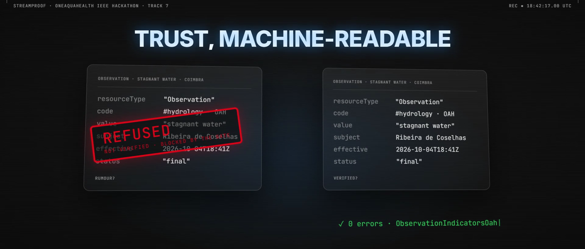
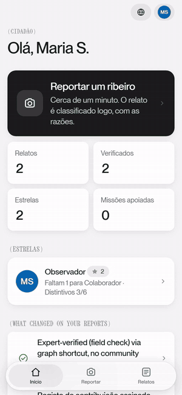
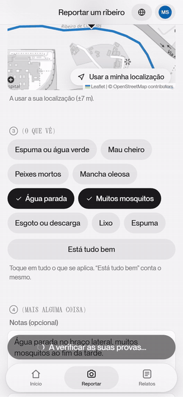
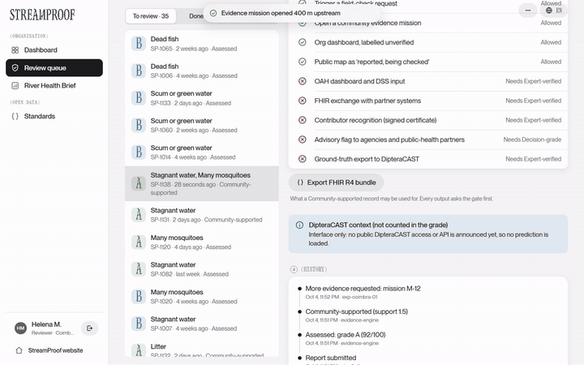
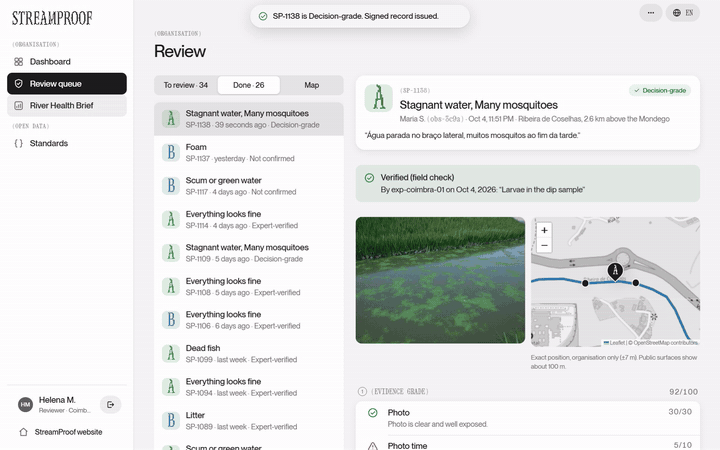
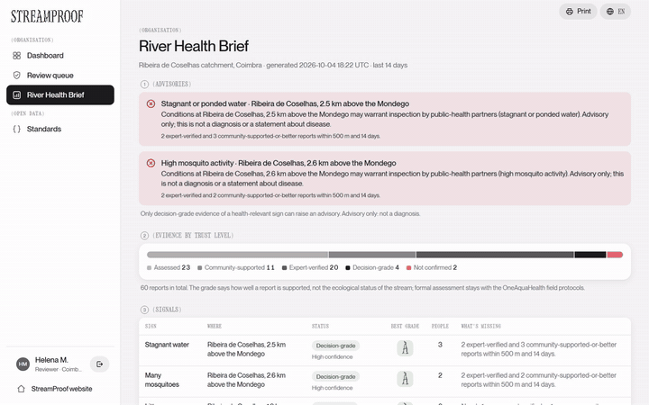

# StreamProof

**Citizen stream reports that a city can trust, and that every system downstream can check.**

Citizens already photograph foamy, stagnant or smelly streams. The hard part is what comes next: a city can't tell which reports to trust, a public-health system can't read them, and nothing says what a report is **allowed to be used for**. To a computer, a rumour and a verified report look exactly the same.

StreamProof is a **trust and provenance add-on to HL7 Europe's official OneAquaHealth FHIR guide**. It grades every report A–D with reasons anyone can read, lets neighbours and experts make it stronger, and writes the result **inside the FHIR record**, together with a published rule for what each trust level may be used for.

> Entry for the [OneAquaHealth IEEE Global Hackathon](https://oneaquahealth-ieee-hackathon.devpost.com/) · **Track 7: Digital Health Standards** · MIT licence

---

## See it in action

### 1. A citizen reports in about a minute 📸

<table>
<tr>
<td align="center">

&nbsp;

</td>
</tr>
<tr>
<td>

<strong>Report in your own language</strong> (here Portuguese, on a phone): take the photo in the page, tap what you see, and the location snaps to the real stream. The report is graded straight away: <strong>A, 92/100</strong>, with seven reasons and the neighbours who saw the same thing (counted as people, not reports).

</td>
</tr>
</table>

### 2. The gate refuses, an expert verifies 🔒

<table>
<tr>
<td align="center">

</td>
</tr>
<tr>
<td>

<strong>A community-supported record can't leave as FHIR.</strong> The permitted-use gate blocks the export. After one expert field check, the record becomes decision-grade and the export goes through.

</td>
</tr>
</table>

### 3. The city gets a brief it can act on 🏛️

<table>
<tr>
<td align="center">

&nbsp;

</td>
</tr>
<tr>
<td>

<strong>The River Health Brief</strong> shows the signals, how sure we are, and next steps taken from the <strong>real OneAquaHealth Catalogue of Measures</strong> (with section and page). It lists stretches nobody has checked lately, and sends expert-verified mosquito records to <strong>DipteraCAST</strong> as ground truth.

</td>
</tr>
</table>

---

## What the hackathon asked for, and what we built

| They asked for | What StreamProof gives | Check it here |
|---|---|---|
| **Impact & alignment (30%)**: improve monitoring, protection and awareness of water ecosystems | Turns citizen photos into evidence a city can act on. Next steps come from OAH's own Catalogue of Measures. Verified ground truth goes to DipteraCAST. Under-observed stretches are listed, so evidence doesn't only follow busy paths. | `/brief`, `app/catalogue.py`, `app/coverage.py` |
| **Innovation & creativity (20%)** | Trust travels **inside** the standard record: grade, trust level and permitted uses. The gate *is* the published rule file, so any receiving system can enforce the same rule. We didn't find either in the prior work below. | `fhir/definitions/CodeSystem-trust-level.json`, `app/permitted_use.py` |
| **Technical implementation (20%)**: prototype, architecture, use of tools, APIs and data | FHIR records pass the HL7 Validator against the **official OAH profiles with 0 errors, 0 warnings**. An unverified record is rejected by the profile itself. Tested Python backend, Next.js PWA, real OpenStreetMap streams and Open-Meteo rainfall. | `fhir/validation/`, `tests/` |
| **Usability & UX (15%)**: ease of use, clarity, accessibility | About one minute to report. Camera in the page. Works offline. 45 languages (right-to-left for Arabic, Hebrew, Persian, Urdu). Every grade explained in plain words. axe accessibility checks clean in light and dark mode. | `web/`, `web/tests/a11y.py` |
| **Feasibility & scalability (15%)**: real-world use, integration with existing systems | Built **on** the OAH FHIR guide, not beside it. Works for any city by search. Can sit behind OAH's Citizen Science App as its trust layer. New codes are proposed back to HL7 Europe. | `ig/`, Standards page |
| **Track 7**: interoperability; FHIR models, AI agents, integration frameworks | FSH profiles derived from `ObservationIndicatorsOah` and `LocationOah`. A ConceptMap from citizen signs to OAH indicators (6 of 9 match; 3 proposed as new codes). FHIR export of every verified record. | `ig/input/fsh/`, `fhir/` |
| **Track alignment statement** | Track 7, stated above and on Devpost. | this page |
| **Project description**: problem, solution, users, impact | This README and the Devpost page. | this page |
| **Demo video** (3–5 min) | 3:12 walkthrough on Devpost. | Devpost |
| **Public code repository with documentation** | This repository: code, tests, FHIR definitions and docs. | this repo |
| **Working prototype** | A working web app and API. Run it in two commands (below). | [Get started](#get-started) |

---

## Research and standards we built on

| Source | Type | What we took from it | Where it shows |
|---|---|---|---|
| **Alabri, A. & Hunter, J. (2010). "Enhancing the Quality and Trust of Citizen Science Data."** *IEEE 6th International Conference on e-Science* (tested with CoralWatch) | **IEEE paper** | Combine automatic quality checks with a trust measure for each observer. | The seven grading checks, including observer track record (`app/grading.py`) |
| Baker, E. et al. (2021). "The Verification of Ecological Citizen Science Data: Current Approaches and Future Possibilities." *Citizen Science: Theory and Practice* 6(1). [doi:10.5334/cstp.351](https://doi.org/10.5334/cstp.351) | Journal paper | A hierarchy: automation or community consensus checks most records, and experts check the flagged ones. | Evidence graph: neighbours, then one-tap expert verification (`app/evidence.py`) |
| Dias, Serra & Feio (2025). *OneAquaHealth Catalogue of Measures* (D2.4). [doi:10.5281/zenodo.20040211](https://doi.org/10.5281/zenodo.20040211), CC BY 4.0 | Project report | Real measures with section, title and page, plus their stated limits. | River Health Brief (`app/catalogue.py`, checked by `tests/test_catalogue.py`) |
| HL7 Europe *OneAquaHealth FHIR Implementation Guide* ([hl7-eu/oah](https://github.com/hl7-eu/oah)) | Standard (HL7 FHIR R4) | Profiles `ObservationIndicatorsOah`, `LocationOah` and the OAH indicator codes. | Our profiles derive from them (`ig/`) |
| ISO 19157 (geographic data quality) | Standard | Data-quality elements. | The seven checks mapped to ISO 19157 on the Standards page |
| OneAquaHealth DipteraCAST announcement (31 Jul 2026) | Project news | The model predicts Diptera taxa and needs verified field data. | Ground-truth export (`app/dipteracast.py`) |

**What's new compared with this work:** a **machine-readable rule for what each trust level may be used for**, and **carrying grade, trust level and permitted uses inside standard FHIR records** that conform to the OneAquaHealth guide.

---

## Get started

**Needs:** Python 3.11+ and Node 20+.

```bash
git clone https://github.com/midhunrajcharles/StreamProof.git
cd StreamProof
pip install -r requirements.txt
python -m app.seed                              # demo data on the real Ribeira de Coselhas, Coimbra
python -m uvicorn app.main:app --port 8740      # the API
```

In a second terminal:

```bash
cd web
npm install
npx next dev -p 3200                            # open http://localhost:3200
```

`/` opens **Try**: choose citizen or organisation. The demo accounts open with one tap; they're listed in `app/seed.py`.

### Try the demo story

1. **As Maria (citizen):** report *stagnant water + many mosquitoes* with a photo. The card shows the grade, seven reasons and a matching earlier report.
2. **As the reviewer:** open it in **Review** and press **Export FHIR**. The gate blocks it: a community-supported record can't leave.
3. **Verify it.** Two different people's reports are now expert-verified nearby, so the signal becomes **decision-grade** and the **River Health Brief** shows an advisory.
4. **Export the FHIR Bundle.** Back as Maria, download the signed certificate, then change one value on the verify page to see the tampering detected.

---

## How it works

```
Citizen PWA ──► Evidence engine (grade A–D + reasons)
                          │
          ┌───────────────┴───────────────┐
    neighbours agree                 expert verifies
          └──────────► Evidence graph ◄───┘
                          │
              PERMITTED-USE GATE (every output)
    ┌────────────┬────────┴────┬──────────────┬──────────────┐
 dashboard   public map    FHIR export    certificate    advisory
```

| Trust level | What it may be used for |
|---|---|
| Report | triage queue, field-check request, community mission |
| Assessed (A–D with reasons) | organisation dashboard, labelled unverified |
| Community-supported | public map, as "reported, being checked" |
| Expert-verified | OAH dashboards, FHIR exchange, DipteraCAST ground truth, recognition |
| Decision-grade | advisory flag to agencies and public-health partners |

The rule above isn't hidden in code. It's the published CodeSystem `trust-level` (property `permits`), and the gate loads that file when it starts.

<details>
<summary><strong>The seven grading checks</strong></summary>

| Check | Points | Example reason |
|---|---|---|
| Photo usable (size, sharpness, exposure) | 30 | "Photo is clear and well exposed." |
| Photo capture time vs report time | 10 | "Photo has no capture time (common after messaging apps)." |
| GPS accuracy | 12 | "Location confirmed (GPS accuracy 7 m)." |
| On a mapped stream | 8 | "On Ribeira de Coselhas (11 m from the mapped channel)." |
| Nearby agreement / contradiction | 20 | "1 other person reported the same within 500 m." |
| Weather context (real rainfall) | 10 | "Consistent with weather: 4.5 mm of rain in 7 days." |
| Observer track record | 10 | "New observer: no history yet." |

Bands: A ≥ 85, B ≥ 70, C ≥ 50, D < 50. No photo caps the grade at C. The grade is rule-based, so every point can be explained.

</details>

<details>
<summary><strong>The FHIR add-on in detail</strong></summary>

- **Observation** (`StreamProofObservation` ← `ObservationIndicatorsOah`): `code` is the OAH indicator (`#diptera`, `#foam`, `#fish`, `#hydrology`), `value` is what the citizen saw, and components carry grade, score, trust level and permitted uses.
- **Location** (`StreamProofLocation` ← `LocationOah`): a site id and a position coarsened to about 100 m.
- **Provenance**: citizen (pseudonym only), the engine, and the verifying expert, with the organisation's signature.
- **The profile refuses unverified records** (invariant `sp-obs-1`), even if an app skipped its own gate.
- No names, no contact details, no exact GPS.
- Sources: FSH in `ig/input/fsh/`. `python tools/build_ig.py` compiles them against the OAH guide (fetched, never copied, because it has no licence file). `python tools/validate_fhir.py` runs the HL7 Validator (needs Java 11+ and `validator_cli.jar` in `tools/`).

</details>

---

## Proof

| Claim | How to check |
|---|---|
| FHIR output conforms to the official OAH profiles | `python tools/validate_fhir.py` → 4 example Bundles + 14 definitions, **0 errors, 0 warnings** (saved in `fhir/validation/`) |
| An unverified record can't validate | Same run: the negative-control Bundle is rejected by `sp-obs-1` only |
| The gate *is* the published rule | `tests/test_oah.py`: changing the file changes the gate |
| Exports are blocked below Expert-verified | `tests/test_engine.py::test_fhir_export_blocked_below_expert` |
| One person can't fake agreement | `test_same_observer_cannot_corroborate_self`, `test_threshold_counts_people_not_reports` |
| Certificates are tamper-evident | `/verify/<id>`: edit any value → "hash mismatch" |
| Every Catalogue measure is quoted correctly | `tests/test_catalogue.py` checks each title and quote against the Catalogue text |

**Tests:** `python -m pytest` (93 backend tests). Web checks (end-to-end, accessibility, offline) are in `web/tests/`.

---

## Honest limits

- **Demo data is synthetic** and labelled so. Stream lines (OpenStreetMap) and rainfall (Open-Meteo) are real.
- **Not connected to OneAquaHealth systems yet.** Sitting behind the OAH Citizen Science App is the proposed adoption path.
- **DipteraCAST:** the export is real, but the prediction slot is an empty interface until a public model API exists.
- **Thresholds are illustrative defaults**, not validated. [docs/CALIBRATION.md](docs/CALIBRATION.md) shows what the rules do, weaknesses included.
- **Translations are machine-assisted** and not yet reviewed by native speakers. Some late-added screens are English only.
- **Advisory, never diagnostic.** Flags say conditions "may warrant inspection".

More in [docs/QA.md](docs/QA.md): hard questions with honest answers.

---

## Project layout

```
app/     backend: grading, evidence graph, permitted-use gate, FHIR, DipteraCAST, brief, API
web/     Next.js web app (installable PWA) + browser tests
ig/      the FHIR add-on as FSH (profiles, CodeSystems, ConceptMap)
fhir/    compiled definitions, example Bundles, validator output
tests/   backend tests
tools/   build and validate the FHIR add-on, calibration report, data refresh
data/    stream geometry, rainfall, Catalogue measures
docs/    QA, calibration, screenshots, GIFs
```

## Credits and licences

- Stream geometry © OpenStreetMap contributors (ODbL). City search: Photon and Nominatim.
- Weather: Open-Meteo.com (CC BY 4.0).
- Measures: OneAquaHealth Catalogue of Measures (CC BY 4.0), matched by us, not by its authors.
- Fonts: Inter, Xanh Mono, Space Grotesk (SIL Open Font License).
- OneAquaHealth is funded by the European Union (grant 101086521). StreamProof is an independent hackathon entry, not endorsed by the project.
- Code: MIT (see `LICENSE`).
